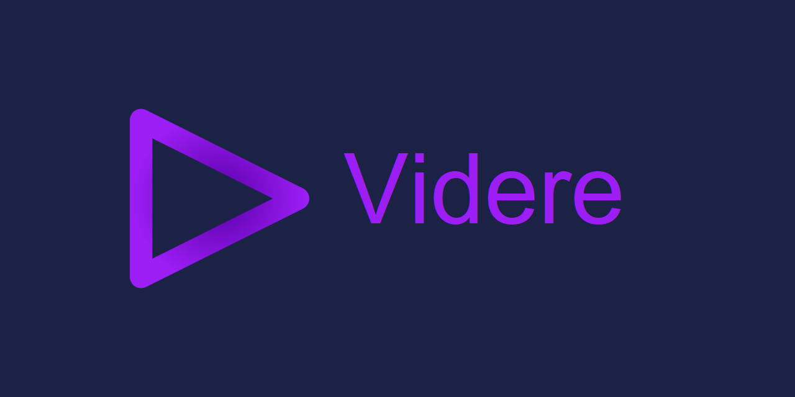
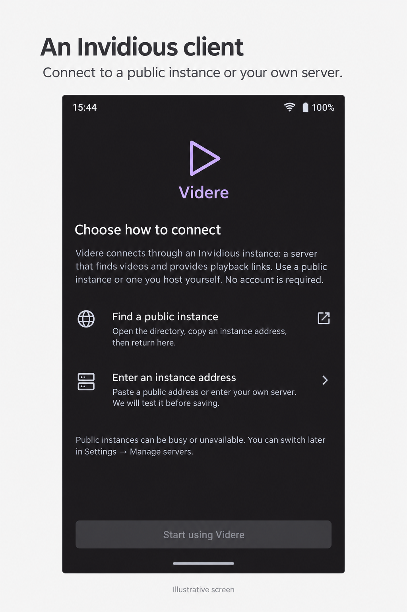
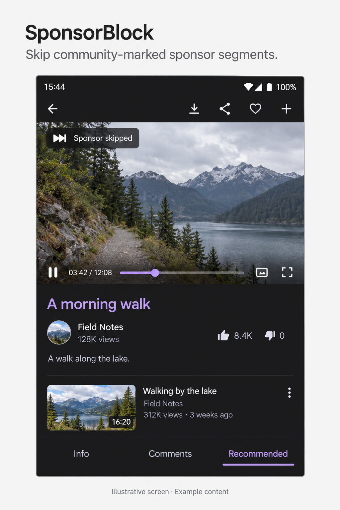
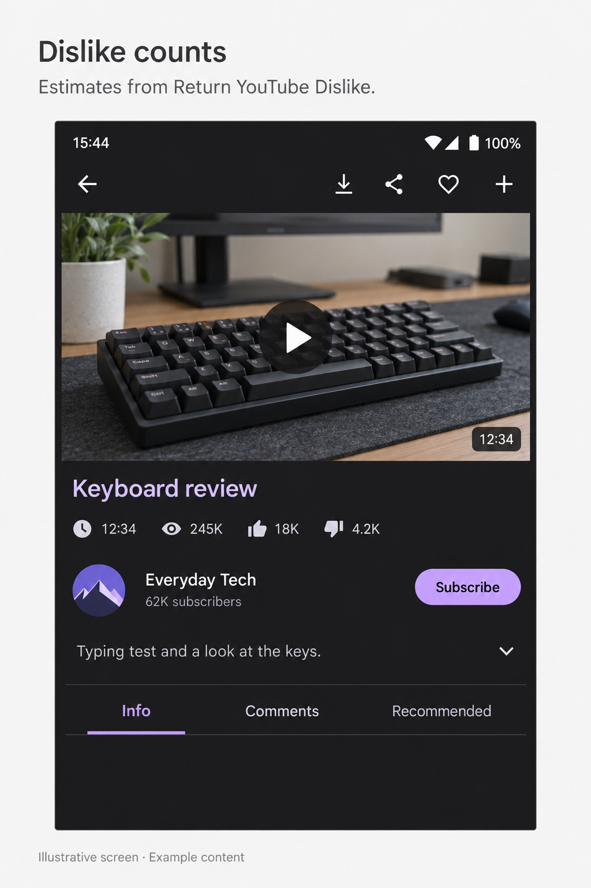
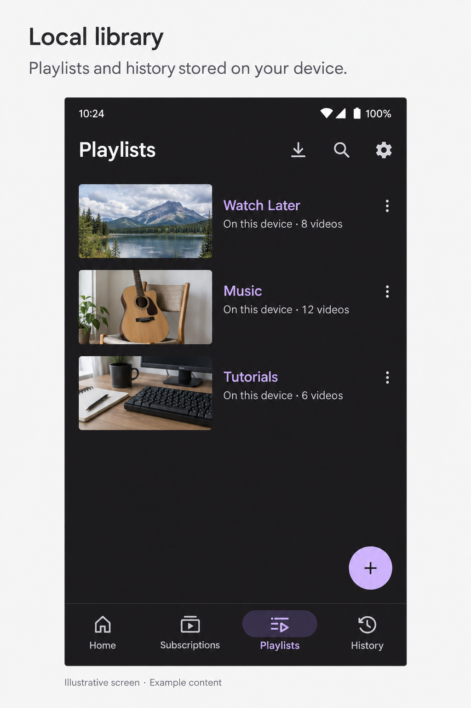

# Videre



**An open-source [Invidious](https://invidious.io) client for Android phones, tablets, and TVs.**

Connect to a public Invidious instance or your own server to watch, listen, and download videos. No Google account needed; an Invidious account is optional.

**[Download the latest APK](https://github.com/DVBeckwitt/Videre/releases/latest)** · Android 7.0+ · [Report a bug](https://github.com/DVBeckwitt/Videre/issues)

[](https://github.com/DVBeckwitt/Videre/actions/workflows/build.yml)
[](./LICENSE)

<p>
  <a href="./screenshots/videre-invidious.png"></a>
  <a href="./screenshots/videre-sponsorblock.png"></a>
  <a href="./screenshots/videre-dislikes.png"></a>
  <a href="./screenshots/videre-private-library.png"></a>
</p>

*Illustrative screens with example content. Click to enlarge.*

## Features

- **SponsorBlock.** Skip community-marked sponsor segments by default.
- **Dislike counts.** Estimates from Return YouTube Dislike, enabled by default.
- **Local library.** Save subscriptions, Watch Later, playlists, and history without an account. An Invidious account is optional.
- **Listen your way.** Background and audio-only playback, picture-in-picture, live streams, and a sleep timer.
- **Watch offline on phones and tablets.** Video and audio downloads with pause, resume, retry, Wi-Fi-only mode, and playlist downloads.
- **Pick up where you left off.** Continue Watching on phone and TV, plus a saved playback queue.
- **Take your library with you.** Export and restore a JSON backup, or import subscriptions from NewPipe.
- **Send a video to your TV.** Pair two Videre installations, transfer the current video and position, and control play/pause from your phone.

Also included: searchable transcripts with seek and copy, subtitles, video filters, and DeArrow.

## Start watching

1. **Install Videre.** Download `app-release.apk` from [GitHub Releases](https://github.com/DVBeckwitt/Videre/releases/latest). Allow installation if Android asks. The same APK supports phones, tablets, and TVs.
2. **Connect to an Invidious instance.** On the Add server screen, choose **Public instances** for the current Invidious directory, or enter your own server address. Select **Test and add server** to check it before saving.
3. **Find something to watch.** Follow channels or save videos to Watch Later. No account needed.

Save more addresses in **Settings → Manage servers → Add server**. Choose **Use this server** to switch; your saved addresses and per-server logins stay in place. **Connection help** also lets you test or switch when playback fails. Accounts belong to their original instance.

This README describes the current source; check the release notes for features included in a downloaded APK.

<details>
<summary><strong>Public instances: links and test results</strong></summary>

Videre uses the [official Invidious directory](https://docs.invidious.io/instances/), with hosts reporting API support shown first. Listing is not a privacy guarantee or a promise that playback works. Public hosts often allow browser playback while restricting apps.

Checked **9 October 2026**, using anonymous HTTPS requests from our development network. None passed video API checks, so we cannot currently recommend any as working in Videre.

| Public host | Result |
|---|---|
| [invidious.f5.si](https://invidious.f5.si) | Search worked; video metadata was empty or blocked (403). |
| [inv.nadeko.net](https://inv.nadeko.net) | Server identified as Invidious; search and video API blocked (403). |
| [invidious.nerdvpn.de](https://invidious.nerdvpn.de) | Server identified as Invidious; search and video API required authorization (401). |
| [yt.chocolatemoo53.com](https://yt.chocolatemoo53.com) | Server identified as Invidious; search and video API blocked (403). |
| [invidious.tiekoetter.com](https://invidious.tiekoetter.com) | Stats returned invalid JSON; search and video API blocked (403). |

These are dated results, not permanent ratings. Tests covered the homepage, stats, search, and video metadata; no host returned usable playback links to test streams. The app checks a selected public host before saving it. Passing that check still does not guarantee every video will play.

For your own server, see the [Invidious GitHub project](https://github.com/iv-org/invidious) and [installation guide](https://docs.invidious.io/installation/).

</details>

## A few useful tips

**Keep watching.** On phones, pull down from the top of the description or comments to minimize the player. On supported Android devices, going Home during video playback opens picture-in-picture. Closing that window keeps the audio playing; pause or stop it from the notification. Android must allow picture-in-picture for Videre.

**Backups.** In Settings, **Export backup** saves local subscriptions, playlists, history, filters, and preferences. **Restore or import subscriptions** accepts a Videre backup or NewPipe subscriptions JSON. Preview, then merge or replace the included local data. Logins and downloaded media are excluded. Reopen Videre after restoring.

**Downloads.** Available on phones and tablets; the TV interface does not support offline playback. The Wi-Fi button limits transfers to Wi-Fi. Pause/resume and retry are available per video; playlist downloads use 720p. Resume keeps partial downloads when the server supports it, otherwise restarts. Interrupted jobs recover when Videre reopens; transfers may stop while the app is closed.

**Continue Watching.** Resume an unfinished video or choose **Resume queue**. Startup stays silent. Progress and queues are local; playback positions do not sync through the cloud.

**Phone remote.** Keep Videre open on both devices on the same trusted Wi-Fi. Select **Receive from phone** on the TV home screen. On your phone, open **Send to TV / remote control**, enter the TV's IP address, port, and six-digit code, then **Send current video**. Position and playing/paused state transfer too; play/pause controls remain available. Pairing uses unencrypted local HTTP and a temporary code. Requires Videre on both devices; no Chromecast or automatic discovery.

## Updates, migration, and privacy

Track updates with Obtainium using `https://github.com/DVBeckwitt/Videre` as a GitHub source. APK updates require the same signing key. Videre is not on F-Droid, IzzyOnDroid, Accrescent, or Google Play; Clipious listings are a different app.

Videre (`com.github.dvbeckwitt.videre`) installs alongside Clipious (`com.github.lamarios.clipious`). Android does not transfer their data. Set up Videre before removing Clipious; the backup importer cannot read its app storage directly.

Local and server libraries stay separate. Your instance's operator affects privacy and reliability. Media proxying is optional; with it off, playback can connect directly to YouTube/Google servers. See the [privacy policy](./docs/privacy.html).

SponsorBlock and Return YouTube Dislike contact their services directly. Both are on by default and can be turned off in Settings.

## Contributing

Bugs and suggestions: [GitHub Issues](https://github.com/DVBeckwitt/Videre/issues). Include your device, Android/Videre versions, instance, reproduction steps, and relevant logs or screenshots with private information removed.

Videre is an independently maintained [Clipious](https://github.com/lamarios/clipious) fork, adding transcript search, navigation improvements, and the local library features above. Inherited translations live in `lib/l10n/*.arb`. Small, focused pull requests are welcome; reuse existing code and remove obsolete alternatives.

<details>
<summary><strong>Build and develop</strong></summary>

Install Git, JDK 21, Android SDK 36, and a device/emulator. Flutter is pinned as a submodule:

```bash
git clone --recurse-submodules https://github.com/DVBeckwitt/Videre.git
cd Videre
./submodules/flutter/bin/flutter pub get
./submodules/flutter/bin/flutter run
```

Existing clone: `git submodule update --init`. On Windows, use `flutter.bat` and `dart.bat`. Build a debug APK with:

```bash
./submodules/flutter/bin/flutter build apk --debug
```

APKs appear in `build/app/outputs/flutter-apk/`. `flutter pub get` regenerates untracked localization files in `lib/l10n/generated/`.

Enable formatting hooks and run the offline regression tests:

```bash
./submodules/flutter/bin/dart run tools/setup_git_hooks.dart
./submodules/flutter/bin/flutter test test/widget_test.dart test/utils/image_object_test.dart test/utils/file_db_test.dart test/videos/state/video_test.dart
```

`lib/` groups code by feature; `lib/utils/` handles Sembast/SQLite storage and `lib/service.dart` calls Invidious. See [CI checks](./.github/workflows/build.yml). `nix-shell` starts local Invidious (`test` / `test`); run all tests with `nix-shell --run './submodules/flutter/bin/flutter test'`.

</details>

<details>
<summary><strong>Signed releases on Windows</strong></summary>

[The release helper](./tools/build_android_release.ps1) installs pinned, hash-verified tools under `%USERPROFILE%\.videre-build-tools` and builds signed artifacts. Supply an existing Gradle signing-properties file outside the repository and managed build directories:

```powershell
$env:ANDROID_KEY_FILE = 'C:\secure\videre\key.properties'
pwsh -NoProfile -File .\tools\build_android_release.ps1
```

`-ValidateOnly` checks directories without downloads or reading signing material. Helper tests: `pwsh -NoProfile -File .\tools\build_android_release.Tests.ps1`. Other release builds also need `ANDROID_KEY_FILE` before `flutter build apk --release`.

</details>

## Credits and license

The name Videre ("to watch") is a nod to Invidious' Latin roots.

Original Clipious code: Copyright (C) 2023 Paul Fauchon and contributors. Videre modifications: Copyright (C) 2026 DVBeckwitt and Videre contributors.

Licensed under the [GNU Affero General Public License v3.0 or later](./LICENSE), without warranty. Videre is not affiliated with Google, YouTube, Invidious, or the original Clipious maintainers. Users are responsible for the laws and terms that apply to their use of the app and their selected instance.
